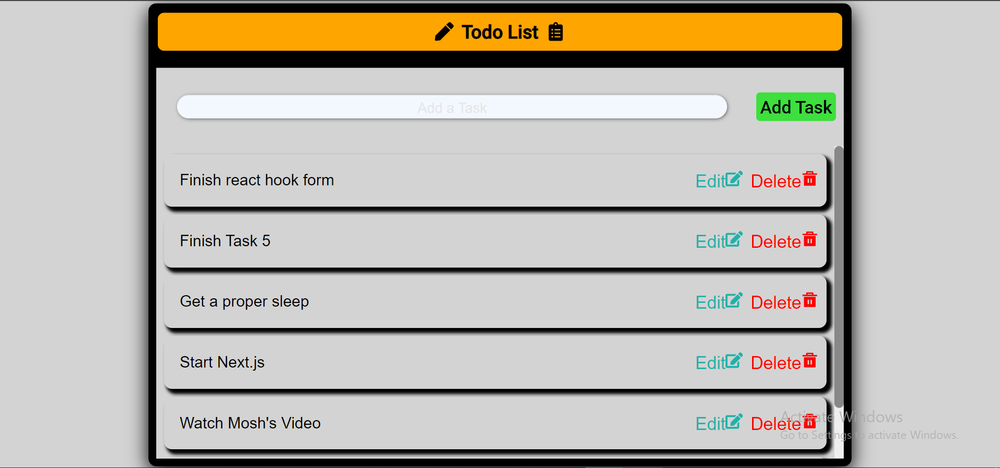

# Todo List Web Application

This is a simple Todo List web application built with React and TypeScript. It allows users to add, edit, and delete tasks, with the data being managed through a `TodoService` and stored in local storage.

## Features

- **Add Todo**: Users can add new tasks to their todo list.
- **Edit Todo**: Users can edit existing tasks.
- **Delete Todo**: Users can delete tasks from their todo list.
- **Local Storage**: Tasks are saved in the browser's local storage, so they persist between page reloads.

## Project Structure

The project consists of the following components and files:

- `TodoForm.tsx`: Component for adding new tasks.
- `TodoList.tsx`: Component for displaying, editing, and deleting tasks.
- `todoService.ts`: Service for managing tasks, including adding, updating, and deleting them.
- `todo.ts`: Type definitions for a todo item.
- CSS files for styling the components.

## Getting Started

Follow these instructions to get a copy of the project up and running on your local machine.

### Prerequisites

- Node.js
- npm or yarn

### Installation

1. Clone the repository:
   ```bash
   git clone https://github.com/your-username/todo-list-web-app.git
   cd todo-list-web-app
   ```

 
    
    
    
    
    
    

# React + TypeScript + Vite

This template provides a minimal setup to get React working in Vite with HMR and some ESLint rules.

Currently, two official plugins are available:

- [@vitejs/plugin-react](https://github.com/vitejs/vite-plugin-react/blob/main/packages/plugin-react/README.md) uses [Babel](https://babeljs.io/) for Fast Refresh
- [@vitejs/plugin-react-swc](https://github.com/vitejs/vite-plugin-react-swc) uses [SWC](https://swc.rs/) for Fast Refresh

## Expanding the ESLint configuration

If you are developing a production application, we recommend updating the configuration to enable type aware lint rules:

- Configure the top-level `parserOptions` property like this:

```js
export default {
  // other rules...
  parserOptions: {
    ecmaVersion: "latest",
    sourceType: "module",
    project: ["./tsconfig.json", "./tsconfig.node.json", "./tsconfig.app.json"],
    tsconfigRootDir: __dirname,
  },
};
```

- Replace `plugin:@typescript-eslint/recommended` to `plugin:@typescript-eslint/recommended-type-checked` or `plugin:@typescript-eslint/strict-type-checked`
- Optionally add `plugin:@typescript-eslint/stylistic-type-checked`
- Install [eslint-plugin-react](https://github.com/jsx-eslint/eslint-plugin-react) and add `plugin:react/recommended` & `plugin:react/jsx-runtime` to the `extends` list
